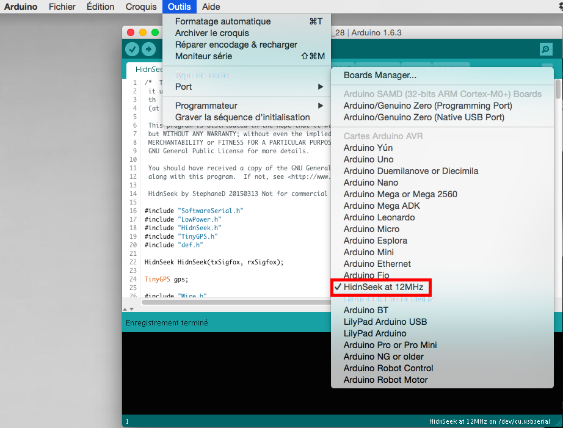

#Arduino Hardware, source code and libraries
##Hardware : changes and needs for Arduino IDE 1.6.x

How to upload new firmware in Hidnsek ?

First install Arduino IDE (https://www.arduino.cc/en/Main/Software)
If Arduino IDE already installed, leave/exit the software.

Second, find in the installation directory the boards.txt file

* /Applications/Arduino.app/Contents/Java/hardware/arduino/avr/boards.txt (Mac)
* c:\Documents and Settings\<USERNAME>\Application Data\Arduino\hardware\arduino\avr\boards.txt (Windows XP)
* c:\Users\<USERNAME>\AppData\Roaming\Arduino\hardware\arduino\avr\boards.txt (Windows Vista)
* ~/.arduino/hardware/arduino/avr/boards.txt (Linux)

Insert at the end of this file the description of HidnSeek from [boards.txt](Hardware/boards.txt) 

##libraries : librairies used to compile the sketch

Copy all libraries in this repository that are not present in your libraries directory

##HidnSeek_v3_28 : Arduino Sketch of the 3.28 release board

Launch Arduino IDE and go to the board selection and select HidnSeek at 12MHz

Load the sketch HidnSeek_v3_28 and compile it. The code size must be 24 950 bytes and available memory is 1027 bytes

In the library HidnSeek (started from Akeru work) you can find examples (Blink and MotionDetection)

Have fun !
